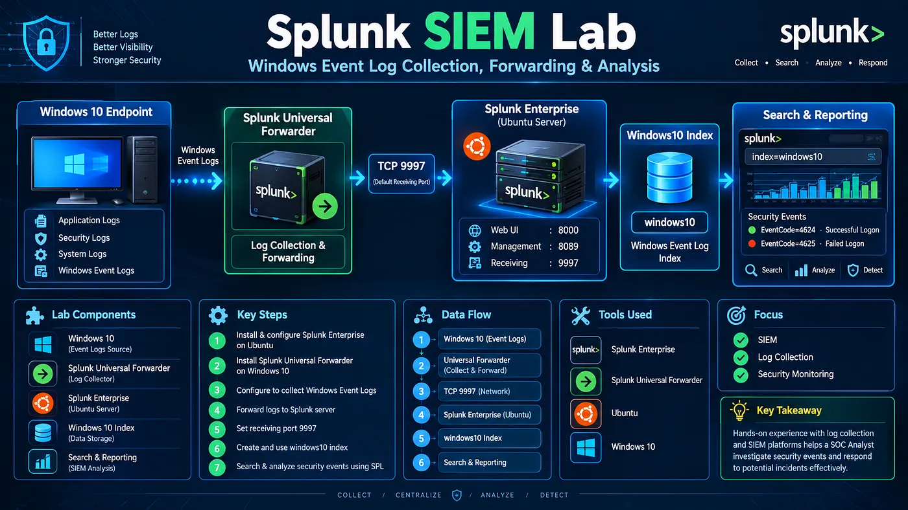
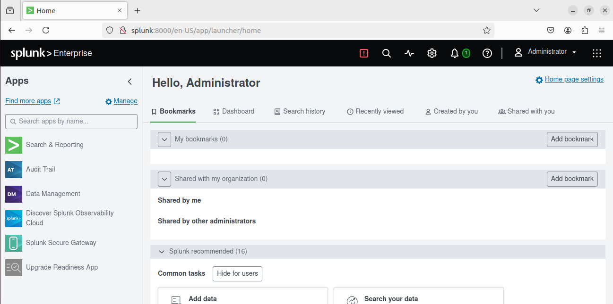
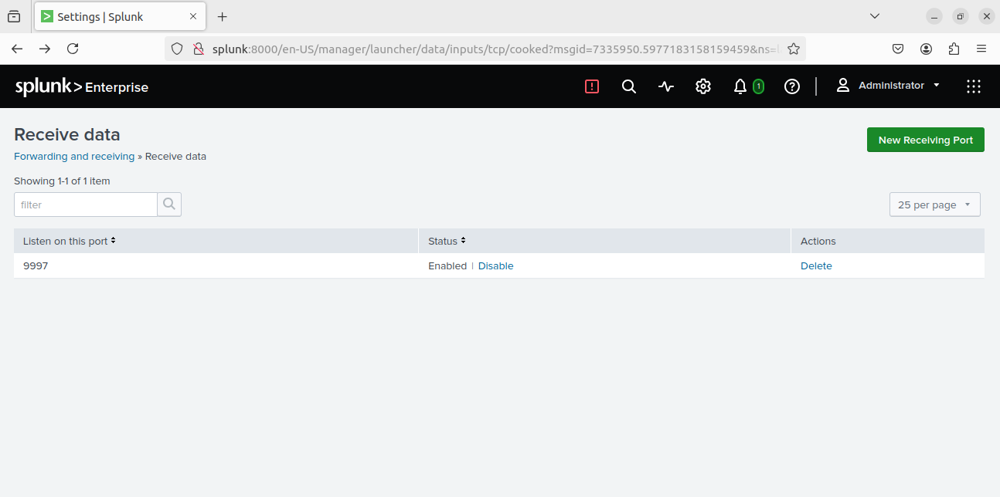
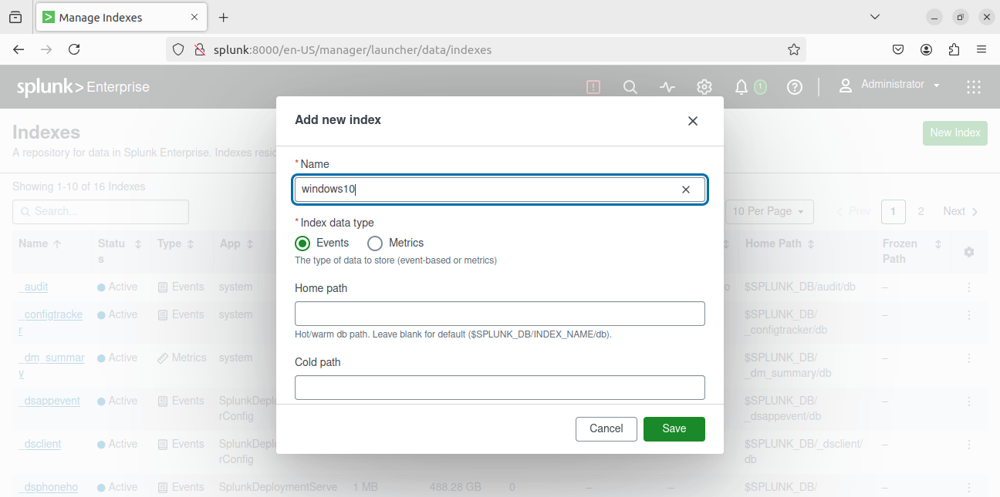
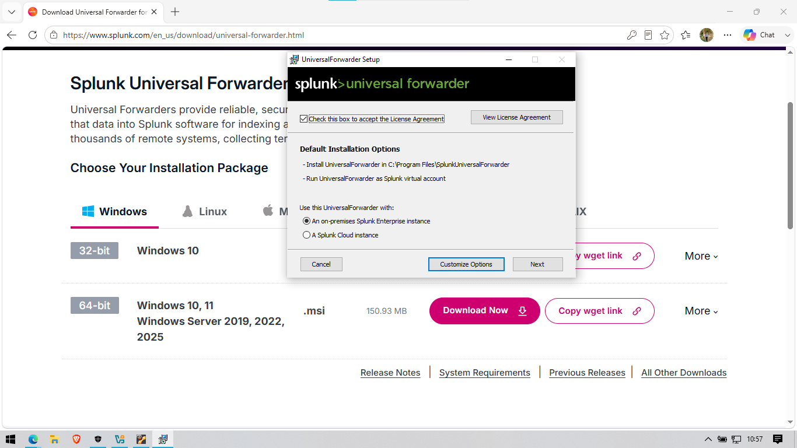
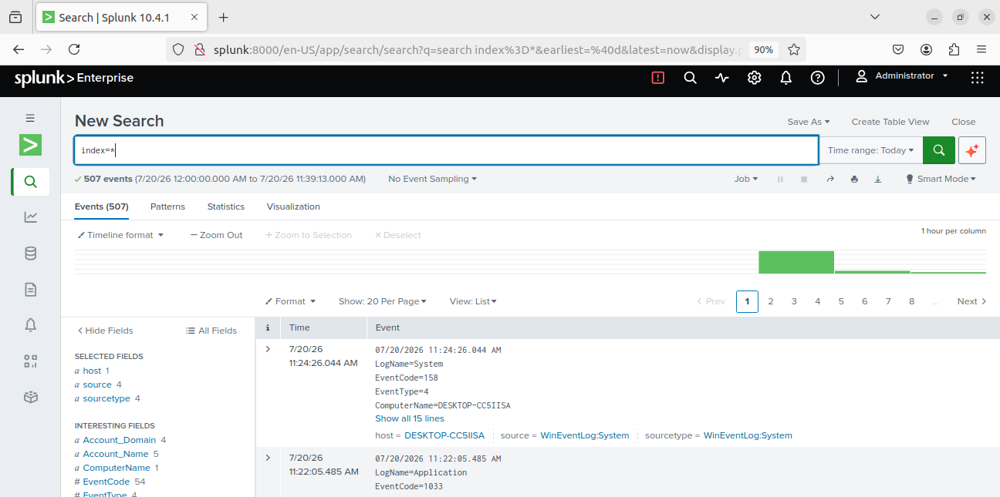
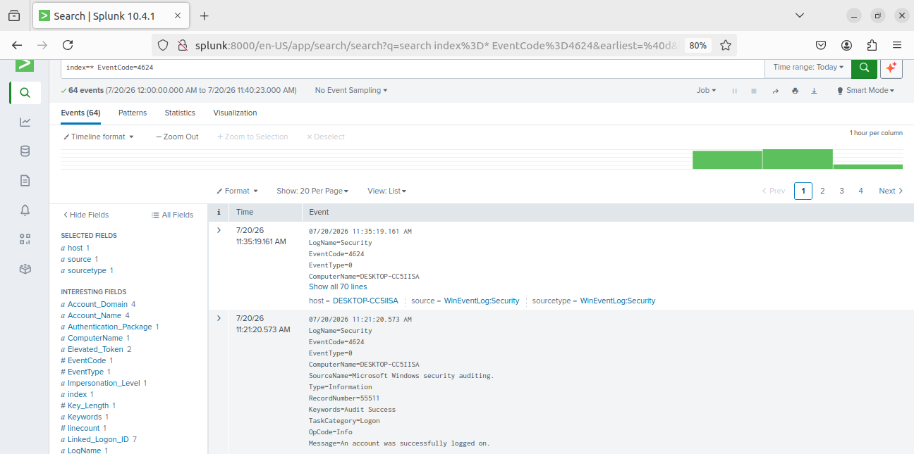

<div align="center">

# 🔐 Splunk SIEM Lab

### Windows Event Log Monitoring & Security Analysis Lab

</div>

A hands-on SIEM lab built with **Splunk Enterprise on Ubuntu** and **Splunk Universal Forwarder on Windows 10** to collect, centralize, and analyze Windows Event Logs.

## 🔎 Overview

This project demonstrates the deployment and configuration of a **Splunk SIEM Lab** for centralized Windows Event Log monitoring and security analysis.

The lab uses **Ubuntu as the Splunk Enterprise server** and **Windows 10 as the monitored endpoint**. The Splunk Universal Forwarder collects Windows Event Logs and forwards them to Splunk Enterprise for centralized monitoring and analysis.

### Objectives

* Install and configure Splunk Enterprise on Ubuntu
* Configure Splunk to receive forwarded data
* Create a dedicated `windows10` index
* Install and configure Splunk Universal Forwarder
* Collect Windows Event Logs
* Verify successful log forwarding
* Search and analyze Windows security events using SPL
* Understand Windows authentication-related Event IDs
* Build practical SOC monitoring experience

---

## 🏗️ Lab Architecture



---

## 🛠️ Tools & Technologies

| Tool / Technology          | Purpose                           |
| -------------------------- | --------------------------------- |
| Ubuntu                     | Splunk Enterprise Server          |
| Splunk Enterprise          | SIEM and Log Analysis             |
| Splunk Universal Forwarder | Windows Log Collection            |
| Windows 10                 | Monitored Endpoint                |
| VirtualBox                 | Virtual Machine Environment       |
| SPL                        | Splunk Search Processing Language |
| Windows Event Logs         | Security Telemetry                |

---

## 🌐 Lab Environment

### Splunk Enterprise — Ubuntu

| Configuration     | Value             |
| ----------------- | ----------------- |
| Operating System  | Ubuntu            |
| Splunk Platform   | Splunk Enterprise |
| Web Interface     | `8000`            |
| Receiving Port    | `9997`            |
| Management Port   | `8089`            |
| Windows Log Index | `windows10`       |

### Windows Endpoint

| Configuration    | Value                      |
| ---------------- | -------------------------- |
| Operating System | Windows 10                 |
| Forwarder        | Splunk Universal Forwarder |
| Log Source       | Windows Event Logs         |
| Destination      | Splunk Enterprise          |
| Receiving Port   | `9997`                     |

---

## ⚙️ Lab Setup

### Phase 1 — Splunk Enterprise Installation

Splunk Enterprise was installed and configured on the Ubuntu virtual machine.

```bash
sudo apt update && sudo apt upgrade -y
sudo apt install curl wget -y
```

After installation, Splunk was started using:

```bash
sudo /opt/splunk/bin/splunk start --accept-license
```

Splunk Web was accessed through:

```text
http://<ubuntu-ip>:8000
```



### Phase 2 — Configure Receiving Port

Splunk Enterprise was configured to receive data from the Windows Universal Forwarder.

```text
Settings
→ Forwarding and Receiving
→ Receive Data
→ New Receiving Port
```

Receiving port:

```text
9997
```



### Phase 3 — Create Windows Index

A dedicated index was created for Windows Event Logs:

```text
windows10
```


Using a separate index helps organize and search Windows security telemetry efficiently.

### Phase 4 — Install Splunk Universal Forwarder

The **Splunk Universal Forwarder** was installed on the Windows 10 endpoint.

The forwarder was configured to communicate with the Splunk Enterprise server.



```text
Receiving Indexer: <Ubuntu-IP>
Receiving Port: 9997
```

### Phase 5 — Windows Event Log Collection

The Universal Forwarder was configured to collect Windows Event Logs.

The collected logs include:

* Security
* System
* Application
* Setup
* Forwarded Events

### Phase 6 — Verify Log Forwarding

The Windows endpoint was verified through Splunk to confirm that Windows Event Logs were successfully received and indexed.

---

## 🪟 Windows Event Log Monitoring

After configuring the Universal Forwarder, Windows Event Logs were forwarded to Splunk Enterprise through **TCP port 9997**.

The events were stored in the:

```text
windows10
```

index.

This allows a SOC analyst to centrally search and investigate endpoint activity from the Splunk dashboard.

---

## 🔍 SPL Log Analysis

### Search All Windows Events

```spl
index=*
```




This query displays Windows events collected from the monitored endpoint.

### Search Successful Logons

```spl
index=* EventCode=4624
```

**Event ID 4624** represents a successful logon.


It can help investigate:

* User account
* Logon type
* Authentication activity
* Source system
* Timestamp

### Search Failed Logons

```spl
index=* EventCode=4625
```

**Event ID 4625** represents a failed logon.

This event can be useful when investigating suspicious authentication activity or potential brute-force attempts.

### Count Events by Event ID

```spl
index=*
| stats count by EventCode
| sort - count
```

This query provides an overview of the most frequently observed Windows Event IDs.

### Authentication Activity

```spl
index=* (EventCode=4624 OR EventCode=4625)
```

This query can be used to investigate successful and failed authentication activity together.

---

## 🆔 Important Windows Event IDs

| Event ID | Description          |
| -------: | -------------------- |
|   `4624` | Successful Logon     |
|   `4625` | Failed Logon         |
|   `4634` | Logoff               |
|   `4720` | User Account Created |
|   `4726` | User Account Deleted |

These Event IDs provide useful security telemetry for Windows endpoint monitoring and SOC investigations.

---

## 🎯 Skills Demonstrated

Through this project, I practiced:

* SIEM deployment
* Splunk Enterprise administration
* Splunk Universal Forwarder configuration
* Windows Event Log collection
* Centralized log management
* SPL query writing
* Windows security event analysis
* Authentication event investigation
* SOC monitoring
* Security log analysis
* Basic threat hunting

---

## 🚀 Future Work

This Splunk SIEM lab can be extended into a complete SOC investigation environment.

Planned activities include:

* Brute-Force Investigation
* PowerShell Activity Detection
* Malware Investigation
* Command-and-Control Detection
* WebShell Investigation
* Data Exfiltration Investigation
* Lateral Movement Investigation
* Privilege Escalation Investigation
* Persistence Investigation
* Full Attack-Chain Investigation
* Threat Hunting with SPL
* Detection Engineering
* MITRE ATT&CK Mapping
* SOC Incident Documentation

---

## ⚠️ Disclaimer

This project is created for **educational and cybersecurity training purposes** in a controlled lab environment.

All security testing and experiments should be performed only on systems and networks for which you have proper authorization.

---

## 👤 Author

**Pritesh Kalsariya**

Cybersecurity Enthusiast | SOC Analyst | VAPT

**LinkedIn:** [www.linkedin.com/in/pritesh-kalsariya-4529a833b](https://www.linkedin.com/in/pritesh-kalsariya-4529a833b)

**Project:** Splunk SIEM Lab

⭐ If you find this project useful, feel free to explore the repository.