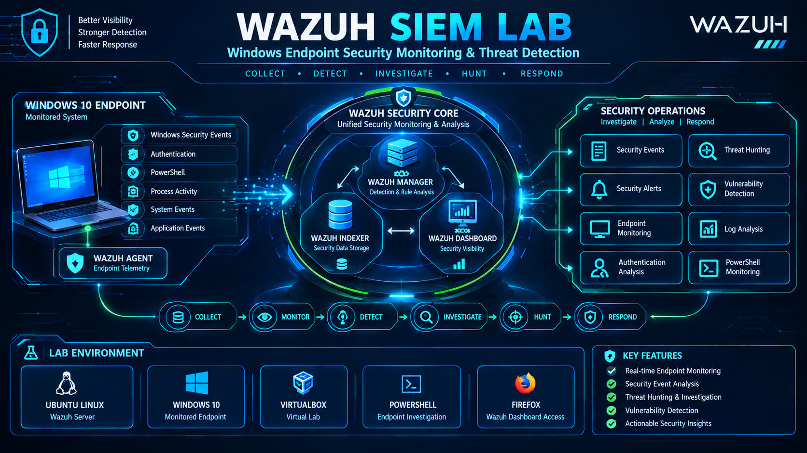
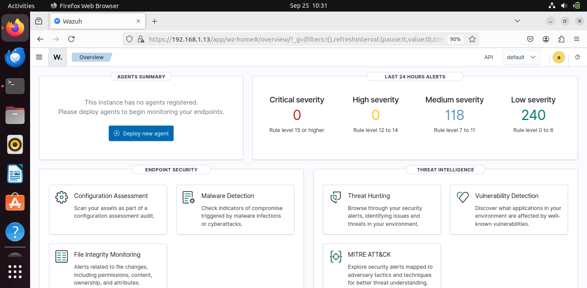
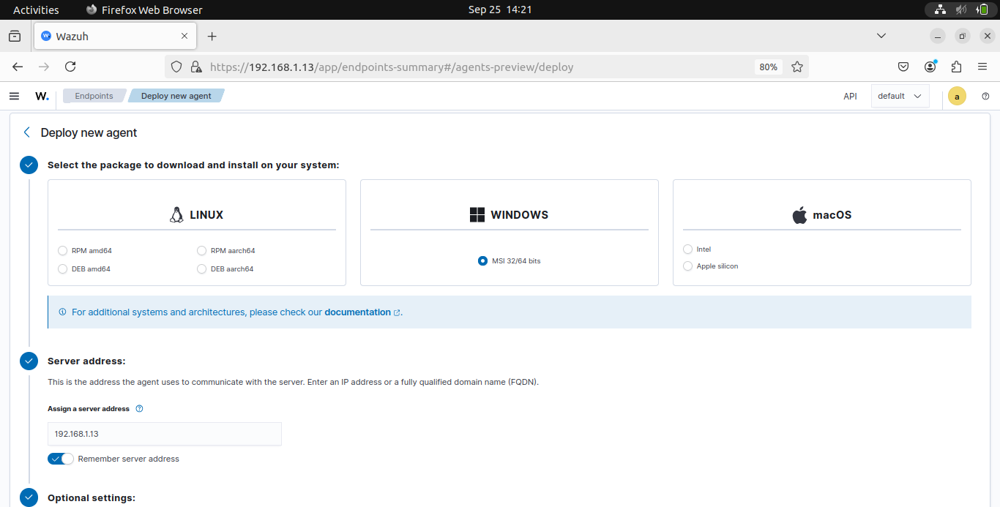
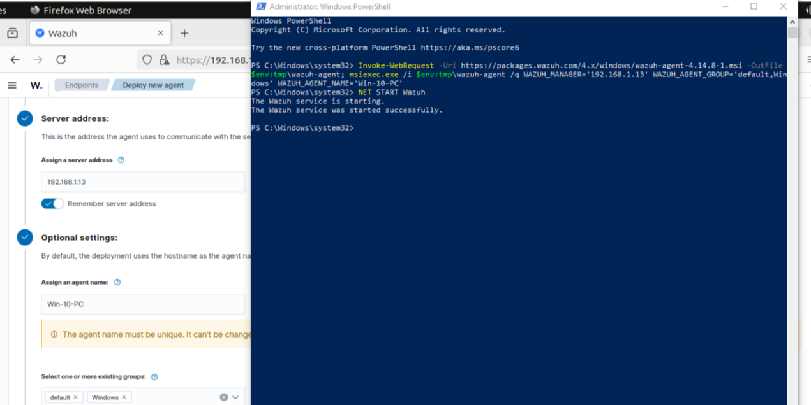
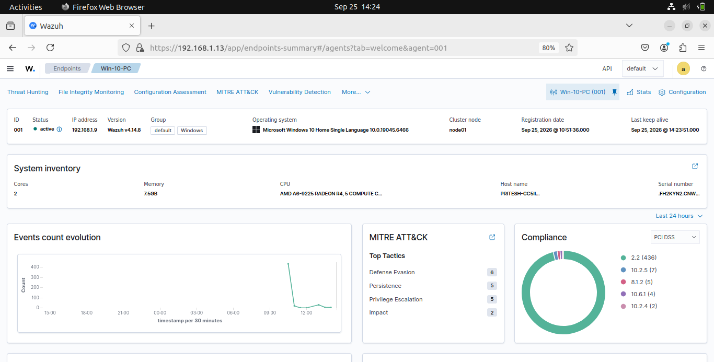
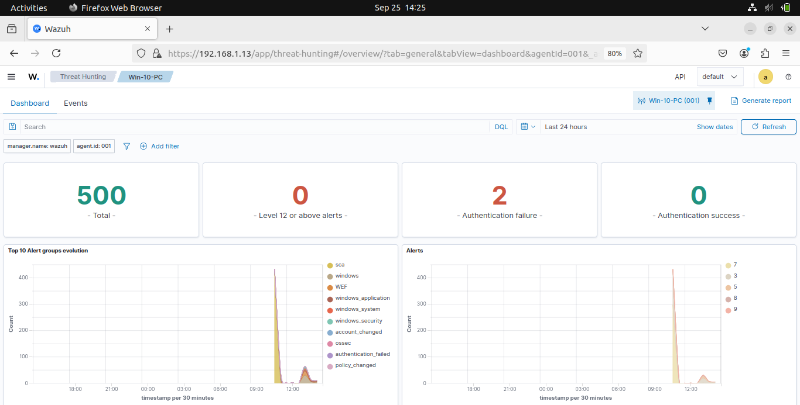
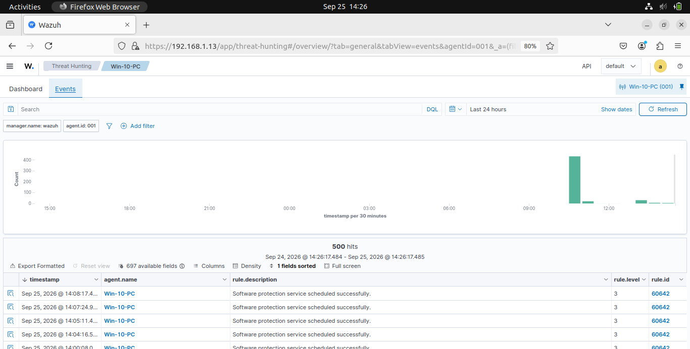
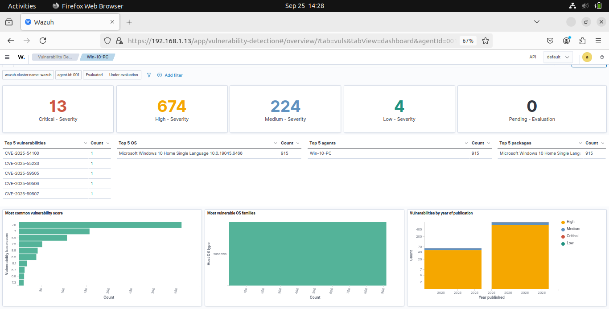

<div align="center">

# 🛡️ Wazuh SIEM Lab

### Windows Endpoint Monitoring & Security Analysis Lab

**SIEM • Endpoint Monitoring • Threat Hunting • Security Analysis**

</div>

A practical **Wazuh SIEM Home Lab** for learning Security Operations Center (SOC) monitoring, Windows endpoint security, security event analysis, threat hunting, and vulnerability detection.

This repository documents the complete lab setup, from **Wazuh installation on Ubuntu** to **Windows 10 agent deployment and security monitoring**. The guide is designed so that others can follow the same steps and build the lab in their own environment.

---

## 🎯 Objectives

The objective of this lab is to install and configure Wazuh on Ubuntu, deploy a Wazuh agent on a Windows 10 endpoint, verify agent communication, and use the Wazuh Dashboard to monitor and analyze security telemetry.

---

# 🏗️ Wazuh SIEM Lab Architecture



---

## 🧰 Environment & Tools

| Category | Details |
|---|---|
| **SIEM Platform** | Wazuh **v4.14** |
| **Server** | Ubuntu Linux |
| **Endpoint** | Windows 10 |
| **Virtualization** | VirtualBox |
| **Administration** | PowerShell |
| **Dashboard** | Wazuh Dashboard |
| **Web Browser** | Firefox |

---

# 1. Install Wazuh on Ubuntu

Start the Ubuntu virtual machine and update the system:

```bash
sudo apt update
sudo apt upgrade -y
```

Download the Wazuh installation script:

```bash
curl -sO https://packages.wazuh.com/4.14/wazuh-install.sh
```

Install Wazuh:

```bash
sudo bash ./wazuh-install.sh -a
```

Verify the Wazuh services:

```bash
sudo systemctl status wazuh-manager wazuh-indexer wazuh-dashboard
```

If required, start the services:

```bash
sudo systemctl start wazuh-manager wazuh-indexer wazuh-dashboard
```

---

# 2. Access Wazuh Dashboard

Open Firefox and access the Wazuh Dashboard:

```text
https://<WAZUH-SERVER-IP>
```

Example:

```text
https://192.168.1.13:443
```

Log in using the credentials generated during the Wazuh installation.



### Create Agent Group

From the Wazuh Dashboard:

```text
Menu → Groups → Add New Group
```

Create a group for the Windows endpoint.

---

# 3. Deploy Windows 10 Agent

Open **Deploy New Agent** from the Wazuh Dashboard.

Select Windows and enter the required information.

Example:

```text
Operating System: Windows
Server Address: 192.168.1.13
Agent Name: Win-10-PC
Agent Group: Windows
```

Wazuh will generate the installation command for the Windows endpoint.



### Install the Wazuh Agent

On the Windows 10 machine, open **PowerShell as Administrator**.

Copy the installation command generated by Wazuh, paste it into PowerShell, and execute it.



---

# 4. Verify Wazuh Agent

Return to the Wazuh Dashboard and open **Active Agents**.

Locate the Windows 10 agent and verify that its status is **Active**.

Open the agent to review details such as:

* Agent name
* IP address
* Operating system
* Agent version
* Connection status



This confirms that the Windows 10 endpoint has been successfully enrolled and is communicating with the Wazuh server.

---

# 5. Threat Hunting

Use the Wazuh threat hunting functionality to search and investigate security telemetry generated by the Windows endpoint.

Look for events related to:

* User activity
* Authentication events
* Process execution
* PowerShell activity
* Windows security events
* Network activity
* Suspicious system activity

Use available fields and filters to narrow down the investigation.



---

# 6. Analyze Agent Events

Open the **Events** section and review security events generated by the Windows endpoint.

Review the available event information to understand endpoint activity and identify events that may require further investigation.



---

# 7. Vulnerability Analysis

Open **Vulnerability Detection** in the Wazuh Dashboard.

Review vulnerability information associated with the Windows 10 endpoint.

Depending on the endpoint configuration, information may include:

* Software
* Version
* CVE
* Severity
* Status



---

## 🎯 Conclusion

This lab successfully demonstrates a Wazuh SIEM environment with an **Ubuntu server and Windows 10 endpoint**. It provides hands-on experience with endpoint onboarding, centralized security monitoring, event analysis, threat hunting, and vulnerability detection using the Wazuh Dashboard.


---

## 👤 Author

**Pritesh Kalsariya**

**LinkedIn:** [www.linkedin.com/in/pritesh-kalsariya-4529a833b](https://www.linkedin.com/in/pritesh-kalsariya-4529a833b)

**Project:** Wazuh SIEM Lab
